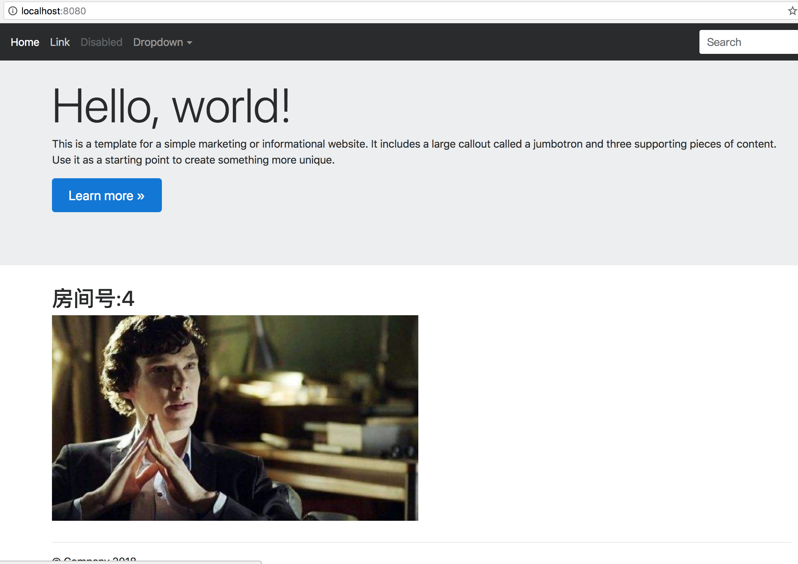
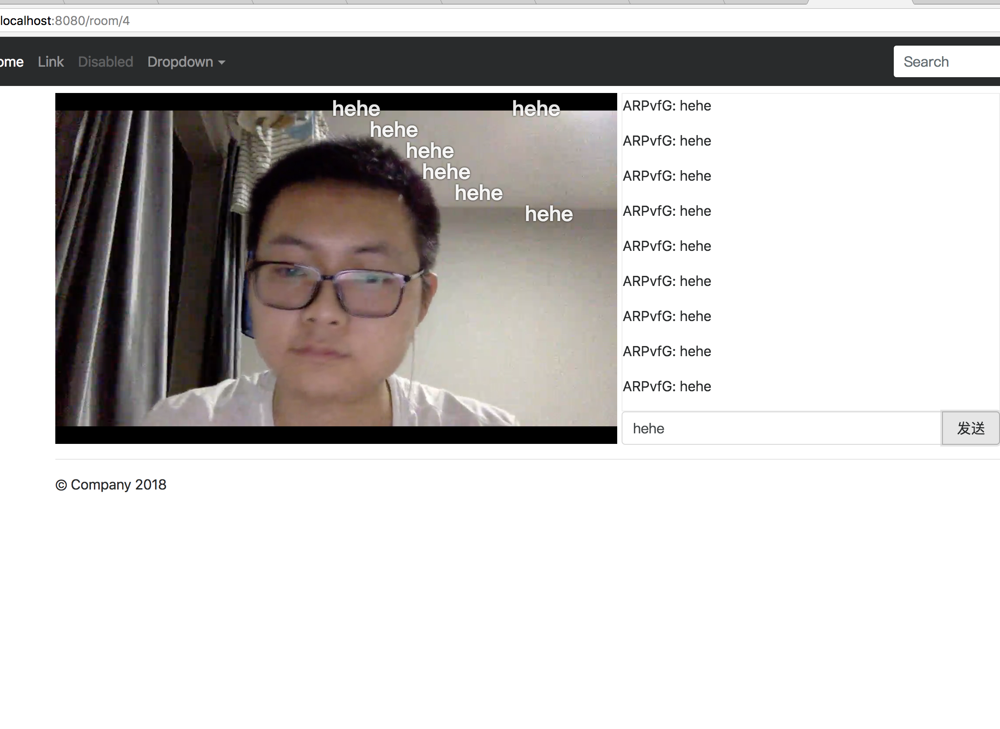

### 简单直播DEMO

#### 业余时间把玩一下，仅供初学者学习探讨

#### 功能包括
1. 直播拉流
2. 聊天室
3. 弹幕

#### WHAT DO YOU NEED
1. Mysql
2. Nginx + rtmp model
3. Obs (推流工具)

#### HOW TO RUN
1. mysql安装 [参考链接](http://www.runoob.com/mysql/mysql-install.html)
2. mysql建表 参考src/resource/confDemo/create_table.sql
3. nginx+rtmp安装 [参考链接](https://www.jianshu.com/p/3224341a205f)
4. nginx配置 参考src/resource/confDemo/nginx.conf
5. run LiveApplication

#### Obs推流配置
1. URL:rtmp://127.0.0.1/hls
2. 流名称:1?topic=xxxx
3. 其中1代表房间号，你可以在room表中插入一条记录（或者先通过post /users/create然后使用userId请求/createRoom 创建一个房间。不推荐，因为缺少页面，操作比较复杂，xxx代表你插入的topic。因为推流的时候做了一下权限验证：on_publish http://127.0.0.1:8080/checkIn;

#### 效果图

